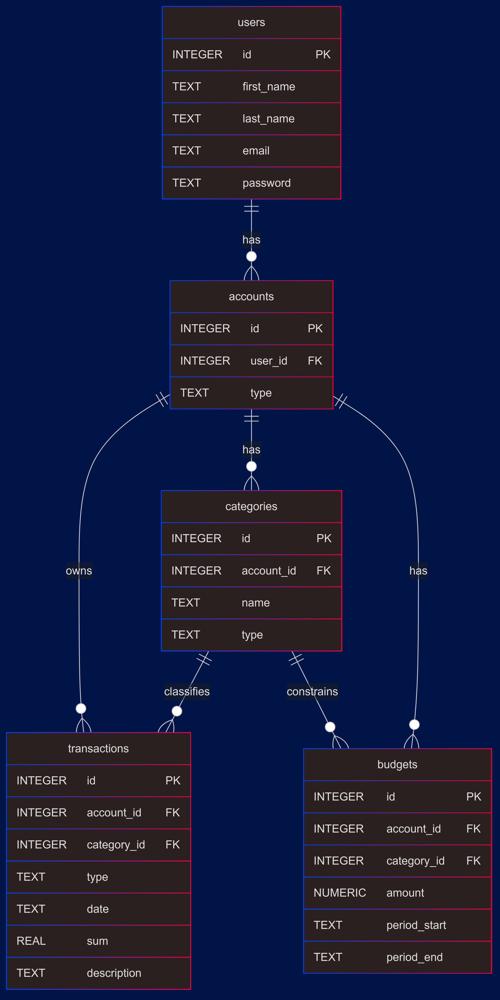

# Design Document

By Adam Kosa

Video overview: [Expense Tracker - CS50SQL Final Project](https://www.youtube.com/watch?v=-GQT3mw9AyQ)

## Scope

The purpose of this database is to help individual users manage their personal finances by tracking their bank accounts, transactions, categorized spending, and budgets.

* Users, who are individuals using the application to track their finances.
* Accounts, representing the financial accounts owned by the users.
* Transactions, which log individual financial operations (income or expenses).
* Categories, to classify transactions as either income or expense and group them meaningfully.
* Budgets, which define planned spending (or income) for certain categories within specific time periods.

Out of scope elements are like currency conversion, recurring transactions or automatic bill payments.

## Functional Requirements

A user should be able to:
* Create and manage their financial accounts
* Record transactions for those accounts
* Categorize each transaction
* Define budgets

The user is not able to analyze investments, assets or track currency exchange rates.
This system is intentionally kept simple and focused solely on personal budget and transaction tracking.

## Representation

Entities are captured in SQLite tables with the following schema.

### Entities

The database includes the following entities:

The `users` table includes:

* `id`, which specifies the unique identifier of each user as an `INTEGER`. This column thus has the `PRIMARY KEY` constraint applied.
* `first_name`, which stores the user’s first name as `TEXT`. The `NOT NULL` constraint ensures every user has a first name.
* `last_name`, which stores the user’s last name as `TEXT`, also with a `NOT NULL` constraint.
* `email`, which stores the user's email address as `TEXT`. It is not constrained as `UNIQUE`, but in practice, it would make sense to enforce uniqueness in the application logic to avoid duplicate accounts.
* `password`, which stores the user's password hash as `TEXT`, not the raw password, ensuring security practices are followed. The field is mandatory via `NOT NULL`.

The `accounts` table includes:
* `id`, which specifies the unique identifier of each account as an `INTEGER`. This column thus has the `PRIMARY KEY` constraint applied.
* `user_id`, which references the user who owns the account. This column thus has the `FOREIGN KEY` constraint applied, referencing the `id` column in the `users` table to ensure data integrity.
* `type`, which defines the account type as a `TEXT` value and is constrained to one of: 'debit', 'credit', or 'saving'. This constraint is enforced using a `CHECK` clause.

The `transactions` table includes:
* `id`, which specifies the unique identifier of each transaction as an `INTEGER`. This column thus has the `PRIMARY KEY` constraint applied.
* `account_id`, which references the user who owns the account. This column thus has the `FOREIGN KEY` constraint applied, referencing the `id` column in the `accounts` table to ensure data integrity.
* `category_id`, which references the user who owns the account. This column thus has the `FOREIGN KEY` constraint applied, referencing the `id` column in the `categories` table to ensure data integrity.
* `type`, which describes the nature of the transaction as a `TEXT` value and is required to be either 'income' or 'expense'. This constraint is enforced using a `CHECK` clause.
* `date`, which stores the transaction date as `TEXT` in ISO format (e.g., 2025-05-25). `NOT NULL` ensures that every transaction has a date.
* `sum`, which records the amount of the transaction. It uses the `REAL` type and a `CHECK` constraint to ensure the amount is strictly positive.
* `description`, which is an optional `TEXT` field giving more context about the transaction.

The `categories` table includes:
* `id`, which specifies the unique identifier of each category as an `INTEGER`. This column thus has the `PRIMARY KEY` constraint applied.
* `account_id`, which references the user who owns the account. This column thus has the `FOREIGN KEY` constraint applied, referencing the `id` column in the `accounts` table to ensure data integrity.
* `name`, which stores the category’s custom name as `TEXT`.
* `type`, which indicates whether the category represents 'income' or 'expense' as a `TEXT`. This is enforced using a `CHECK` constraint.

The `budgets` table includes:
* `id`, which specifies the unique identifier of each budget as an `INTEGER`. This column thus has the `PRIMARY KEY` constraint applied.
* `account_id`, which references the user who owns the account. This column thus has the `FOREIGN KEY` constraint applied, referencing the `id` column in the `accounts` table to ensure data integrity.
* `category_id`, which references the user who owns the account. This column thus has the `FOREIGN KEY` constraint applied, referencing the `id` column in the `categories` table to ensure data integrity.
* `amount`, the planned amount as a `NUMERIC`(12, 2) type, allowing two decimal places. It must be non-negative due to the `CHECK` (amount >= 0) constraint.
* `period_start` and `period_end`, which represent the start and end dates of the budget as `TEXT` values in ISO format. A `CHECK` constraint ensures that `period_end` is not earlier than `period_start`.

### Relationships

The below entity relationship diagram describes the relationships among the entities in the database.

As detailed by the diagram:

* One user can own 0 to many accounts. A user may have no accounts yet, or might manage multiple accounts (e.g., one debit and one saving account). Each account belongs to one and only one user.
* One account can be associated with 0 to many transactions. If no transactions have been made yet, there are 0; otherwise, each account may record multiple transactions (income and expense). Each transaction is tied to one and only one account.
* One account can have 0 to many categories. Categories help organize transactions within that account (e.g., groceries, rent). Each category belongs to one and only one account. This setup allows category names to be reused across accounts without conflict.
* One category can be linked to 0 to many transactions. That is, some categories may have no transactions yet, while others may have many. A transaction is assigned to one and only one category.
* One account can also have 0 to many budgets. Each budget entry is linked to a specific category within an account and defines a budgeted amount for a given time range. Each budget is specific to one account.
* One category can also be associated with 0 to many budgets, and each budget references exactly one category. This enables budgeting for specific categories (e.g., limit 'groceries' to 50,000 HUF per month).
* Altogether, budgets form a many-to-one relationship both with accounts and with categories, effectively acting as a constraint over the intersection of the two.

## Optimizations

Per the typical queries in queries.sql, it is common for users of the application to retrieve all transactions for a specific account, or to filter transactions by date or category. To optimize performance for these frequent lookup operations, the following indexes have been created:
* `transaction_date_search`: An index on the `date` column in the `transactions` table allows for efficient filtering and sorting of transactions based on date.
* `transaction_category_search`: An index on the `category_id` column in the `transactions` table improves performance when filtering transactions by category.
* `transaction_account_search`: An index on the `account_id` column in the `transactions` table speeds up the retrieval of all transactions tied to a specific account.

## Limitations

* Passwords are stored as plain text, which is a security risk. In a real-world application, passwords should be hashed and salted before being stored.
* The schema only supports individual, static transactions, it cannot model recurring payments (e.g., monthly rent).
* Each account belongs to one and only one user. Supporting the concept of shared account would require a shift to a many-to-many relationship between users and accounts
